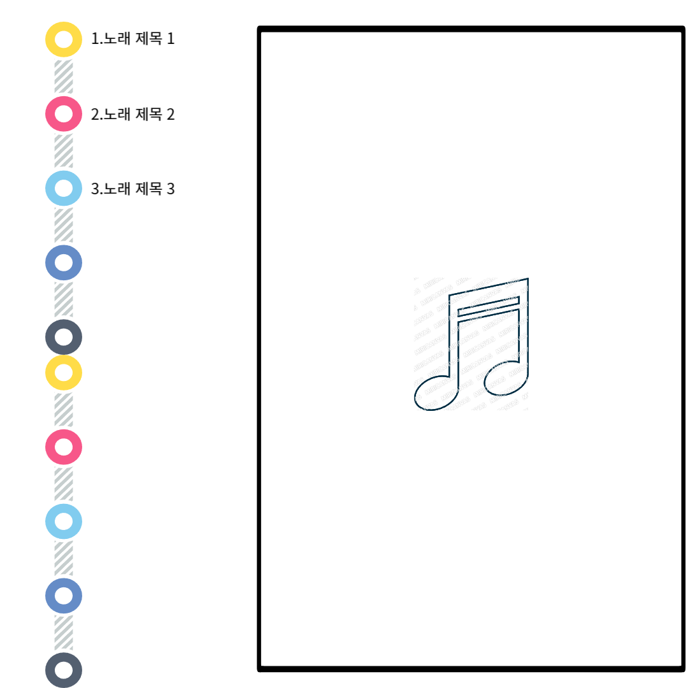

# Music Explorer (ME)

## 1. 개요
Music Explorer 사용자의 표정에 따른 감정을 분석하여 플레이리스트를 생성하여 보여주는 서비스이다.

기존의 유튜브뮤직이나 멜론, 지니 등의 노래 추천 알고리즘을 이용할때 들었던 음악을 기반으로 추천해 주기때문에
노래가 뒤섞여 추천되었다.

현재의 감정에 따른 추천이나 상세 키워드 기입이 없었기때문에 감정분석과
키워드 입력을 추가해 더욱 확실하게 나의 취향에 따른 노래 추천을 받을 수 있도록 설계했다. 

## 2. 활용한 인공지능 API
### 2.1 API의 입력과 출력
사용자의 얼굴 사진과 추천 받고 싶은 노래의 키워드, 노래의 종류 등을 입력한다.

이에 출력값은 분석된 감정과 키워드, 노래의 종류등에 기반하여 플레이리스트를 출력해준다.

### 2.2 Music Explorer 서비스에서 사용할 API
Spotify API, Face API

## 3. 웹페이지 구축

### 3.1 출력문
### 3.2 추가내용
### 3.3 웹페이지 구성

## 4. 실행결과
